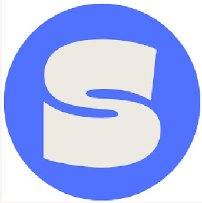

<!--
* Thanks for checking out stuxnet. If you have a suggestion
* that would make this better, please fork the repo and create a pull request
* or simply open an issue with the tag "enhancement".
* Don't forget to give the project a star!
* Thanks again! Now go create something AMAZING! :D
-->

<!-- PROJECT SHIELDS -->
<!--
* I'm using markdown "reference style" links for readability.
* Reference links are enclosed in brackets [ ] instead of parentheses ( ).
* See the bottom of this document for the declaration of the reference variables
* for contributors-url, forks-url, etc. This is an optional, concise syntax you may use.
* https://www.markdownguide.org/basic-syntax/#reference-style-links
-->

<!-- PROJECT LOGO -->
 

  <!--  -->

  <h1 align="center">StuxNet</h1>

  

    Making Student Life Easy!
    <!--  
    <a href="https://github.com/hardikpedia/bitastik"><strong>Explore the docs »</strong></a>
      -->
    <!--  
    <a href="https://github.com/hardikpedia/bitastik">View Demo</a>
    ·
    <a href="https://github.com/hardikpedia/bitastik/issues">Report Bug</a>
    ·
    <a href="https://github.com/hardikpedia/bitastik/issues">Request Feature</a> -->
  

<!-- [Website Link](https://bitastik.vercel.app) -->

<!-- ABOUT THE PROJECT -->
## About The Project

<h2>DOMAIN</h2>
WEB DEVELOPMENT (MERN STACK)

 

<h3>IDEA</h3>

With the shift in the mode of learning and our lives being digitalized, the college experience has been nothing but an exhausting experience for all of us. After the voracious college expectation soon turned into disappointment, we decided to come to the following solution.

STUXNET a one stop solution for the students of BIT Mesra to cater to their day-to-day college needs. A culmination of multitudes of ideas and platforms into one.

This app consists of an event to keep each one of you up to date with the latest happenings across the college without the fuss of being added to the newsrooms and various WhatsApp groups. Another key feature include erp of the college.It also includes the  placement opportunity both on-campus and off-campus.
It also consists of epistle the official news platform.

(<a href="#top">back to top</a>)

### Built With

This section list any major frameworks/libraries used in our project. Here are a few examples.

* [Next.js](https://nextjs.org/)
* [React.js](https://reactjs.org/)
* [Firebase](https://firebase.google.com/)
* [MongoDb](https://www.mongodb.com/)
* [Mongoose](https://mongoosejs.com/)

(<a href="#top">back to top</a>)

<h2>HOW TO RUN</h2>
<ul>
<li>Download the files</li>
<li>Using `npm install` download the dependencies to setup the environment.</li>
<li>Finally run the development server using `npm run dev`</li>
<li>Open http://localhost:3000 with your browser to see the result.</li>
<li>You can start editing the page by modifying pages/index.js. The page auto-updates as you edit the file.</li></ul>

 

<!-- <h2>TEAM MENTOR</h2>
 Utkrisht sharma
 He is the best mentor we ever had and he is super helpful and awesome ❤️ -->

(<a href="#top">back to top</a>)

<!-- CONTACT -->
## Team Members

Adarsh Kumar Singh- adarshaks19@gmail.com 
Anish Gupta - anishgupta700@gmail.com 
Aditya Pandey - adityap1707@gmail.com 

<!-- 
Project Link: [https://github.com/hardikpedia/bitastik](https://github.com/hardikpedia/bitastik) -->

(<a href="#top">back to top</a>)

